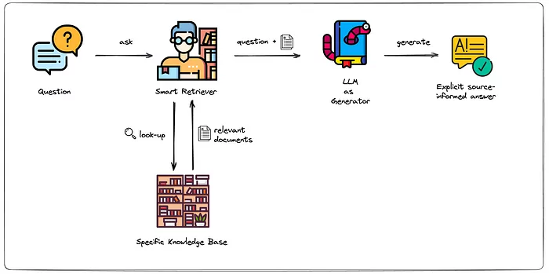

# RAG LangChain Project



---
## Project Overview

This project implements a Retrieval-Augmented Generation (RAG) system using LangChain. RAG combines the power of large language models with a knowledge retrieval component to generate more accurate, contextual, and up-to-date responses.

### Key Features

- **Document Processing**: Upload and process only PDF format.
- **Vector Database Integration**: Store and retrieve document embeddings efficiently
- **Context-Aware Responses**: Generate answers based on both the language model's knowledge and retrieved document context
- **Web UI**: User-friendly interface built with Streamlit
- **Command Line Interface**: Alternative CLI for programmatic usage

### Technology Stack

- LangChain for orchestrating the RAG pipeline
- Hugging Face for embeddings and models
- Google API for additional capabilities
- Streamlit for the web interface
- Docker for containerization

## Installation & Setup

### Using Docker (Recommended)

Build the Docker image:
```bash
docker build -t rag_app .
```

Run the container:
```bash
docker run --name rag_app_container -p 8501:8501 rag_app
```

After that, access to `localhost:8501` to enjoy the chatbot.

#### Setting up API Keys in Docker

After starting the container, you need to create a `.env` file inside the container:

1. Access the running container:
```bash
docker exec -it rag_app_container bash
```

2. Create and edit the `.env` file:
```bash
nano .env
```

3. Add your API keys to the file:
```
GOOGLE_API_KEY=your_google_api_key
HUGGING_FACE_TOKEN=your_hugging_face_token
```

4. Save and exit (in nano: press Ctrl+X, then Y, then Enter)

### Without Docker

1. Create a Python virtual environment (Python 3.10 required):
```bash
python3.10 -m venv venv
source venv/bin/activate  # On Windows: venv\Scripts\activate
```

2. Install dependencies:
```bash
pip install -r requirements.txt
```

3. Create a `.env` file in the project root directory:
```bash
nano .env  # or use any text editor
```

4. Add your API keys to the `.env` file:
```
GOOGLE_API_KEY=your_google_api_key
HUGGING_FACE_TOKEN=your_hugging_face_token
```

## Running the Application

### Web Interface
To run the Streamlit web application:
```bash
streamlit run src/app/app.py
```
Then open your browser and navigate to `http://localhost:8501`

The web interface allows you to:
- Upload documents for processing
- Ask questions about the uploaded documents
- View the retrieved context used to generate answers
- Configure parameters for the RAG system

### CLI Interface
To use the command-line interface:
```bash
python src/main.py
```

The CLI supports commands for:
- Document ingestion: `python src/main.py ingest --file path/to/document.pdf`
- Querying: `python src/main.py query "Your question about the documents"`
- System configuration: `python src/main.py config --embedding_model "model_name"`

## How It Works

1. **Document Ingestion**: Documents are processed, chunked, and embedded using transformer models
2. **Vector Storage**: Embeddings are stored in a vector database for efficient similarity search
3. **Query Processing**: When a question is asked:
   - The question is embedded using the same model
   - Similar document chunks are retrieved from the vector database
   - Retrieved context is combined with the question
   - The language model generates an answer based on both its knowledge and the retrieved context

## Troubleshooting

- **API Key Issues**: Ensure your environment variables are correctly set
- **Memory Problems**: Adjust chunk sizes if processing large documents
- **Performance Issues**: Consider using GPU acceleration if available